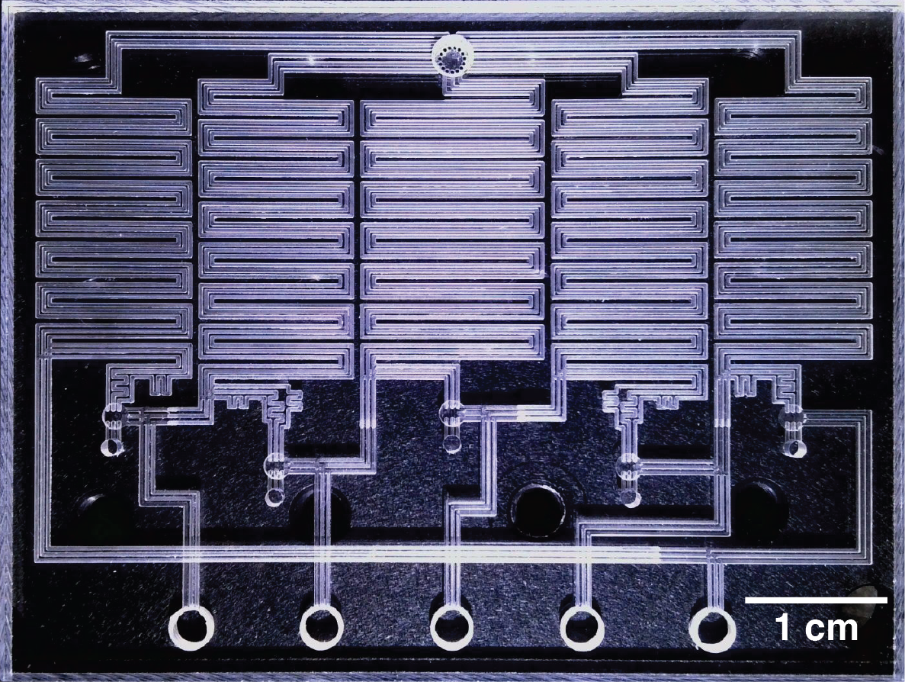

# Pneumatic oscillator for biomedical device control

The Adobe Illustrator file contains the design of a high-flow pneumatic oscillator for controlling biomedical devices.  Instructions for engraving the design into polycarbonate sheets and bonding the device are included in [this work](https://www.medrxiv.org/content/10.1101/2024.01.24.24301744v1).
